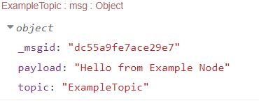

# node-red-contrib-typescript-template :package:
This is a typescript template project for developing Node-RED nodes. 

### **Example Node included!** :icecream:

## Project Setup :zap:
Follow these steps to set up your Typescript Node-RED node project:
1. Clone this repository and create your project's directory, changing the `<PROJECT NAME>` field:
```console
git clone https://github.com/Doth-J/node-red-contrib-typescript-template.git
mv node-red-contrib-typescript-template node-red-contrib-<PROJECT NAME>
cd ./node-red-contrib-<PROJECT NAME>
```
2. Edit the `package.json`, change **only** the `<*>` fields shown below:
```json
{
  "name": "node-red-contrib-<PROJECT NAME>",
  "description": "Node-RED node for <DESCRIPTION>",
  "author":"<AUTHOR>",
  "keywords": [
    "node-red",
    "<KEYWORD-1>",
    "<KEYWORD-2>"
  ]
}
```
3. Save your edited `package.json` and install the dependencies:
```console
npm install
```
### Well Done! :tada:
Your are all set and ready to begin developing your nodes.

## Creating your Nodes :gear:
The template provides you with a basic Node-RED node typescript project structure. Check below to see how to set up your node types and appereance on the pallet.
### Node Logic :link:
Go ahead and edit the contents of the [example](./src/node.ts) file inside the `./src` folder:
#### Configuration Interfaces
* Import the Node-RED module and setup the [properties](https://nodered.org/docs/creating-nodes/properties) of your node. Inside the config interface add all the properties your node will have, the NodeDef already contains properties for ``id``,``name``,``type`` and ``z``. These properties will be accessible anc configurable in the node's appereance part. The configuration interfaces can be created as follows:
```typescript
import * as NodeRED from "node-red";

interface ExampleNodeConfig extends NodeRED.NodeDef{
    // Add all your node properties here
    topic:string
}
```
:warning: __You will need to create as many NodeConfig interfaces as the nodes in the file!__
#### Internal logic
* To create the [node's logic](https://nodered.org/docs/creating-nodes/node-js), start by making a node function, inside this function create the actual node in the Node-RED nodes using the API and then develop the node's interal logic when it receives input message. Finally you will need to register the type of the node with Node-RED's API, following is a code snippet for an example node:
```typescript
export = function(RED:NodeRED.NodeAPI){

    // Example Node Function
    function ExampleNode(this:NodeRED.Node, config:ExampleNodeConfig){
      // Create the actual node using the Node-RED API
      RED.nodes.createNode(this,config);
      // Node input listener, when node receives a msg
      this.on('input',(msg:any,send,done)=>{
          // This is where you set up your node's internal logic
          
          // Using the Node's configuration variables
          msg.topic = config.topic;
          // Changing the payload of the msg
          msg.payload = msg.payload.message || "Hello from Example Node";
          // Sending out the message
          send(msg);
          // Check if everything is done
          if(done) done();
      });
    }
    // Node is registered with the 'example' type using the Node-RED API
    RED.nodes.registerType('example',ExampleNode);

}
```
### Node Appearance :scarf:
Go ahead and edit the contents of the [example](./nodes/node.html) file inside the `./nodes` folder. Here is a reference to official documenation regarding the [HTML file](https://nodered.org/docs/creating-nodes/node-html). The node appereance defines how your node is shown in the pallet, it's UI behavior and what properties will be accessible for configuration. To begin making your node's appereance follow these steps:

* Register your node's type and creating the node's main [appereance](https://nodered.org/docs/creating-nodes/appearance) `<script>` tag:
```html
<script type="text/javascript" id="node-example">
    // The type here must match the type register in your node's logic
    RED.nodes.registerType('example',{
        // The category in which the node will be shown
        category:'exampleCategory',
        // Your node's color:
        color:'#e2b784',
        // Your node's input interfaces
        inputs:1,
        // Your node's input intefaces' labels
        inputLabels: "maybe a message",
        // Your node's output interfaces
        outputs:1,
        // Your node's output intefaces' labels
        outputLabels: "a message with a topic",
        // Your node's icon
        // Icons can be added in the `./nodes/icon` folder in svg format
        // These can be directly accessed by Node-RED with no relative path required   
        icon:"node.svg", 
        // Your node's properties:
        // These will be accessible and configurable from the edit dialog (Check next step)
        // These will need to match the configuration properties defined in your node' config interface
        // The `name`,`type`,`id` and `z` variables are created and required by Node-RED 
        // !!! DON'T use the default properties above, unless you know what you're doing! :)
        defaults: {
            name: {value:''},
            topic: {value:''}
        },
        // Your node's label in the workspace
        label: function(){
            return this.name || 'example'
        }
    });
</script>
```
* Create the [edit dialog](https://nodered.org/docs/creating-nodes/edit-dialog) for your node's configuration:
```html
<script type="text/html" data-template-name="example">
<!-- The node's properties, defined in the `defaults` in the main script above.
     These properties can be made accessible to the user in the edit dialog below. -->
    <div class="form-row">
        <!-- Label of the node property -->
        <label for="node-input-name"><i class="fa fa-tag"></i> Name</label>
        <!-- The id for the property must match the `node-input-[property name]` pattern -->
        <input type="text" id="node-input-name" placeholder="Name">
    </div>
    <div class="form-row">
        <!-- Label of the node property -->
        <label for="node-input-topic"><i class="fa fa-cog"></i> Topic</label>
        <!-- The id for the property must match the `node-input-[property name]` pattern -->
        <input type="text" id="node-input-topic" placeholder="Topic" required>
    </div>
</script>
```
* Create the [help](https://nodered.org/docs/creating-nodes/help-style-guide) dialog and your node's documentation: 
```html
<script type="text/html" data-help-name="example">
<!-- The node's help dialog appereance.
     The info below is shown when hovering over 
     the pallet or opening the documenation tab. -->
  <p>Typescript example Node-RED node</p>
  <!-- Documentation for your node's inputs -->
  <h3>Inputs</h3>
  <dl class="message-properties">
      <dt>payload
          <span class="property-type">string</span>
  </dt>
  <!-- Documentation for your node's outputs -->
  <h3>Outputs</h3>
  <dl class="message-properties">
      <dt>payload
          <span class="property-type">string</span>
  </dt>
  <!-- More documentation about your node -->
  <h3>Details</h3>
  <p>Some more information about the node.</p>
</script>
```
## Building your Nodes :hammer:
To build the nodes you have developed execute the following command:
```console
npm run build
```
## Installing your Nodes :arrow_down_small:
Once you have build your nodes, _go inside the `~/.node-red` directory_ and execute the following command:
```console
npm install ../path/to/project/node-red-contrib-<PROJECT NAME>
```
## Full Example Node :icecream:
### Node Logic :link:
* [`node.ts`](./src/node.ts)
```typescript
import * as NodeRED from "node-red";

interface ExampleNodeConfig extends NodeRED.NodeDef{
    topic:string
}

export = function(RED:NodeRED.NodeAPI){

    function ExampleNode(this:NodeRED.Node, config:ExampleNodeConfig){
      RED.nodes.createNode(this,config);
      this.on('input',(msg:any,send,done)=>{
          msg.topic = config.topic;
          msg.payload = msg.payload.message || "Hello from Example Node";
          send(msg);
          if(done) done();
      });
    }

    RED.nodes.registerType('example',ExampleNode);
}
```
### Node Appearance :scarf:
* [`node.html`](./nodes/node.html) 
```html
<script type="text/javascript" id="node-example">
    RED.nodes.registerType('example',{
        category:'exampleCategory',
        color:'#e2b784',
        inputs:1,
        inputLabels: "maybe a message",
        outputs:1,
        outputLabels: "a message with a topic",
        icon:"node.svg", 
        defaults: {
            name: {value:''},
            topic: {value:''}
        },
        label: function(){
            return this.name || 'example'
        }
    });
</script>
<script type="text/html" data-template-name="example">
    <div class="form-row">
        <label for="node-input-name"><i class="fa fa-tag"></i> Name</label>
        <input type="text" id="node-input-name" placeholder="Name">
    </div>
    <div class="form-row">
        <label for="node-input-topic"><i class="fa fa-cog"></i> Topic</label>
        <input type="text" id="node-input-topic" placeholder="Topic" required>
    </div>
</script>
<script type="text/html" data-help-name="example">
    <p>Typescript example Node-RED node</p>
    <h3>Inputs</h3>
    <dl class="message-properties">
    <dt>payload
        <span class="property-type">string</span>
    </dt>
    <h3>Outputs</h3>
    <dl class="message-properties">
    <dt>payload
        <span class="property-type">string</span>
    </dt>
    <h3>Details</h3>
    <p>Some more information about the node.</p>
</script>
```
---
### Example Node in Node-RED :ice_cream:
* Once the example node is [installed in Node-RED](#installing-your-nodes-arrow_down_small), we can find it under the category `exampleCategory` defined by the node's appearance attributes. Let's make a simple flow for our new node:

    

*  Double-click on the example node and add a `Topic` to our example node: 

    

* Clicking the injector node with an **empty** `msg.payload`, we get:

    

* Double-click on the injector node and add the `msg.payload.message` variable of the injector node: 

    

* Clicking the injector node with a message in the `msg.payload.message`, we get:

    

### Have fun developing your nodes! :star: